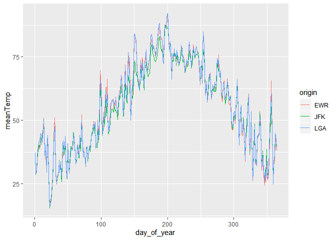

Practice Exam
=============

This practice exam asks you to do several code wrangling tasks that we
have done in class so far.

Clone this repo into Rstudio and fill in the necessary code. Then,
commit and push to github. Finally, turn in a link to canvas.

-   lm(performance ~ origin + ... + dest)
-   ignore "max\_wind\_gust"

<!-- -->

    ## -- Attaching packages ------------------------------------------------------------------------------------------------------------------------------ tidyverse 1.3.0 --

    ## v ggplot2 3.2.1     v purrr   0.3.3
    ## v tibble  2.1.3     v dplyr   0.8.3
    ## v tidyr   1.0.0     v stringr 1.4.0
    ## v readr   1.3.1     v forcats 0.4.0

    ## Warning: package 'ggplot2' was built under R version 3.6.2

    ## Warning: package 'readr' was built under R version 3.6.2

    ## -- Conflicts --------------------------------------------------------------------------------------------------------------------------------- tidyverse_conflicts() --
    ## x dplyr::filter() masks stats::filter()
    ## x dplyr::lag()    masks stats::lag()

    ## Warning: package 'nycflights13' was built under R version 3.6.2

    ## 
    ## Attaching package: 'lubridate'

    ## The following object is masked from 'package:base':
    ## 
    ##     date

Make a plot with three facets, one for each airport in the weather data.
The x-axis should be the day of the year (1:365) and the y-axis should
be the mean temperature recorded on that day, at that airport.

    # check practice.R 

    # add column that counts number of day of the year (2013)
    weather %>% mutate(day_of_year = yday(time_hour))

    ## # A tibble: 26,115 x 16
    ##    origin  year month   day  hour  temp  dewp humid wind_dir wind_speed
    ##    <chr>  <int> <int> <int> <int> <dbl> <dbl> <dbl>    <dbl>      <dbl>
    ##  1 EWR     2013     1     1     1  39.0  26.1  59.4      270      10.4 
    ##  2 EWR     2013     1     1     2  39.0  27.0  61.6      250       8.06
    ##  3 EWR     2013     1     1     3  39.0  28.0  64.4      240      11.5 
    ##  4 EWR     2013     1     1     4  39.9  28.0  62.2      250      12.7 
    ##  5 EWR     2013     1     1     5  39.0  28.0  64.4      260      12.7 
    ##  6 EWR     2013     1     1     6  37.9  28.0  67.2      240      11.5 
    ##  7 EWR     2013     1     1     7  39.0  28.0  64.4      240      15.0 
    ##  8 EWR     2013     1     1     8  39.9  28.0  62.2      250      10.4 
    ##  9 EWR     2013     1     1     9  39.9  28.0  62.2      260      15.0 
    ## 10 EWR     2013     1     1    10  41    28.0  59.6      260      13.8 
    ## # ... with 26,105 more rows, and 6 more variables: wind_gust <dbl>,
    ## #   precip <dbl>, pressure <dbl>, visib <dbl>, time_hour <dttm>,
    ## #   day_of_year <dbl>

    # one for each airport in the weather data

    ## view(weather) to check which airports present

    # EWR <- weather %>% mutate(day_of_year = yday(time_hour)) %>% 
    #   filter(origin == "EWR")
    # 
    # JFK <- weather %>% mutate(day_of_year = yday(time_hour)) %>% 
    #   filter(origin == "JFK")
    # 
    # LGA <- weather %>% mutate(day_of_year = yday(time_hour)) %>% 
    #   filter(origin == "LGA")

    # x-axis = day of the year (1:365)
    # y-axis = mean temperature

    # 1. change time_hour to day of year
    # 2. group by origin and day of year -> ex) EWR-1 one group
    # 3. ggplot with three lines for origin

    weather %>% mutate(day_of_year = yday(time_hour)) %>% group_by(origin, day_of_year) %>% summarize(meanTemp = mean(temp, na.rm = T)) %>% 
      ggplot()+geom_line(aes(x = day_of_year, y = meanTemp, col = origin))

Make a non-tidy matrix of that data where each row is an airport and
each column is a day of the year.  
-&gt; each element = average temperature -&gt; some function with '\_'
tidy

For each (airport, day) contruct a tidy data set of the airport's
"performance" as the proportion of flights that departed less than an
hour late.

Construct a tidy data set to that give weather summaries for each
(airport, day). Use the total precipitation, minimum visibility, maximum
wind\_gust, and average wind\_speed.

Construct a linear model to predict the performance of each
(airport,day) using the weather summaries and a "fixed effect" for each
airport. Display the summaries.

Repeat the above, but only for EWR. Obviously, exclude the fixed effect
for each airport. -&gt; fixed effect?
