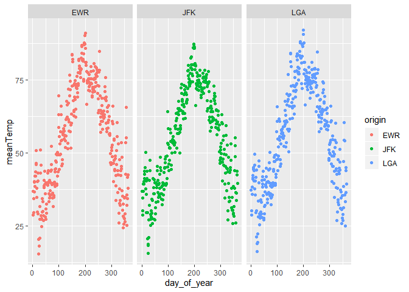

Practice Exam
=============

This practice exam asks you to do several code wrangling tasks that we
have done in class so far.

Clone this repo into Rstudio and fill in the necessary code. Then,
commit and push to github. Finally, turn in a link to canvas.

-   lm(performance ~ origin + ... + dest)
-   ignore "max\_wind\_gust"

<!-- -->

    ## -- Attaching packages ---------------------------------------------------------------- tidyverse 1.3.0 --

    ## v ggplot2 3.2.1     v purrr   0.3.3
    ## v tibble  2.1.3     v dplyr   0.8.3
    ## v tidyr   1.0.0     v stringr 1.4.0
    ## v readr   1.3.1     v forcats 0.4.0

    ## Warning: package 'ggplot2' was built under R version 3.6.2

    ## Warning: package 'readr' was built under R version 3.6.2

    ## -- Conflicts ------------------------------------------------------------------- tidyverse_conflicts() --
    ## x dplyr::filter() masks stats::filter()
    ## x dplyr::lag()    masks stats::lag()

    ## Warning: package 'nycflights13' was built under R version 3.6.2

    ## 
    ## Attaching package: 'lubridate'

    ## The following object is masked from 'package:base':
    ## 
    ##     date

1. Make a plot with three facets, one for each airport in the weather data. The x-axis should be the day of the year (1:365) and the y-axis should be the mean temperature recorded on that day, at that airport.
-----------------------------------------------------------------------------------------------------------------------------------------------------------------------------------------------------------------

    # check practice.R 

    # add column that counts number of day of the year (2013)
    weather %>% mutate(day_of_year = yday(time_hour))

    ## # A tibble: 26,115 x 16
    ##    origin  year month   day  hour  temp  dewp humid wind_dir wind_speed
    ##    <chr>  <int> <int> <int> <int> <dbl> <dbl> <dbl>    <dbl>      <dbl>
    ##  1 EWR     2013     1     1     1  39.0  26.1  59.4      270      10.4 
    ##  2 EWR     2013     1     1     2  39.0  27.0  61.6      250       8.06
    ##  3 EWR     2013     1     1     3  39.0  28.0  64.4      240      11.5 
    ##  4 EWR     2013     1     1     4  39.9  28.0  62.2      250      12.7 
    ##  5 EWR     2013     1     1     5  39.0  28.0  64.4      260      12.7 
    ##  6 EWR     2013     1     1     6  37.9  28.0  67.2      240      11.5 
    ##  7 EWR     2013     1     1     7  39.0  28.0  64.4      240      15.0 
    ##  8 EWR     2013     1     1     8  39.9  28.0  62.2      250      10.4 
    ##  9 EWR     2013     1     1     9  39.9  28.0  62.2      260      15.0 
    ## 10 EWR     2013     1     1    10  41    28.0  59.6      260      13.8 
    ## # ... with 26,105 more rows, and 6 more variables: wind_gust <dbl>,
    ## #   precip <dbl>, pressure <dbl>, visib <dbl>, time_hour <dttm>,
    ## #   day_of_year <dbl>

    # one for each airport in the weather data

    ## view(weather) to check which airports present

    # EWR <- weather %>% mutate(day_of_year = yday(time_hour)) %>% 
    #   filter(origin == "EWR")
    # 
    # JFK <- weather %>% mutate(day_of_year = yday(time_hour)) %>% 
    #   filter(origin == "JFK")
    # 
    # LGA <- weather %>% mutate(day_of_year = yday(time_hour)) %>% 
    #   filter(origin == "LGA")

    # x-axis = day of the year (1:365)
    # y-axis = mean temperature

    # 1. change time_hour to day of year
    # 2. group by origin and day of year -> ex) EWR-1 one group
    # 3. ggplot with three lines for origin

    weather %>% mutate(day_of_year = yday(time_hour)) %>% group_by(origin, day_of_year) %>% summarize(meanTemp = mean(temp, na.rm = T)) %>% 
      ggplot()+geom_line(aes(x = day_of_year, y = meanTemp, col = origin))

facet\_wrap
===========

    weatherQ1 <- weather %>% mutate(day_of_year = yday(time_hour)) %>% group_by(origin, day_of_year) %>% summarize(meanTemp = mean(temp, na.rm = T))

    # str(weatherQ1)

    ggplot(data = weatherQ1) + geom_point(mapping = aes(x= day_of_year, y = meanTemp, color = origin)) + facet_wrap(~origin)

2. Make a non-tidy matrix of that data where each row is an airport and each column is a day of the year.
---------------------------------------------------------------------------------------------------------

-&gt; each element = average temperature -&gt; some function with '\_'
tidy

    # Check organizing.R

    # row = airport
    # col = day of the year

    weatherQ1 %>% pivot_wider(names_from = day_of_year, values_from = meanTemp)

    ## # A tibble: 3 x 365
    ## # Groups:   origin [3]
    ##   origin   `1`   `2`   `3`   `4`   `5`   `6`   `7`   `8`   `9`  `10`  `11`  `12`
    ##   <chr>  <dbl> <dbl> <dbl> <dbl> <dbl> <dbl> <dbl> <dbl> <dbl> <dbl> <dbl> <dbl>
    ## 1 EWR     36.8  28.7  29.6  34.3  36.6  39.9  40.3  38.6  42.1  43.6  42.0  46.0
    ## 2 JFK     36.9  28.6  30.1  34.7  36.8  39.3  40.1  39.4  42.7  43.6  41.3  45.0
    ## 3 LGA     37.2  28.8  30.3  35.8  38.3  41.0  41.4  42.3  44.9  44.3  40.3  43.9
    ## # ... with 352 more variables: `13` <dbl>, `14` <dbl>, `15` <dbl>, `16` <dbl>,
    ## #   `17` <dbl>, `18` <dbl>, `19` <dbl>, `20` <dbl>, `21` <dbl>, `22` <dbl>,
    ## #   `23` <dbl>, `24` <dbl>, `25` <dbl>, `26` <dbl>, `27` <dbl>, `28` <dbl>,
    ## #   `29` <dbl>, `30` <dbl>, `31` <dbl>, `32` <dbl>, `33` <dbl>, `34` <dbl>,
    ## #   `35` <dbl>, `36` <dbl>, `37` <dbl>, `38` <dbl>, `39` <dbl>, `40` <dbl>,
    ## #   `41` <dbl>, `42` <dbl>, `43` <dbl>, `44` <dbl>, `45` <dbl>, `46` <dbl>,
    ## #   `47` <dbl>, `48` <dbl>, `49` <dbl>, `50` <dbl>, `51` <dbl>, `52` <dbl>,
    ## #   `53` <dbl>, `54` <dbl>, `55` <dbl>, `56` <dbl>, `57` <dbl>, `58` <dbl>,
    ## #   `59` <dbl>, `60` <dbl>, `61` <dbl>, `62` <dbl>, `63` <dbl>, `64` <dbl>,
    ## #   `65` <dbl>, `66` <dbl>, `67` <dbl>, `68` <dbl>, `69` <dbl>, `70` <dbl>,
    ## #   `71` <dbl>, `72` <dbl>, `73` <dbl>, `74` <dbl>, `75` <dbl>, `76` <dbl>,
    ## #   `77` <dbl>, `78` <dbl>, `79` <dbl>, `80` <dbl>, `81` <dbl>, `82` <dbl>,
    ## #   `83` <dbl>, `84` <dbl>, `85` <dbl>, `86` <dbl>, `87` <dbl>, `88` <dbl>,
    ## #   `89` <dbl>, `90` <dbl>, `91` <dbl>, `92` <dbl>, `93` <dbl>, `94` <dbl>,
    ## #   `95` <dbl>, `96` <dbl>, `97` <dbl>, `98` <dbl>, `99` <dbl>, `100` <dbl>,
    ## #   `101` <dbl>, `102` <dbl>, `103` <dbl>, `104` <dbl>, `105` <dbl>,
    ## #   `106` <dbl>, `107` <dbl>, `108` <dbl>, `109` <dbl>, `110` <dbl>,
    ## #   `111` <dbl>, `112` <dbl>, ...

3. For each (airport, day) contruct a tidy data set of the airport's "performance" as the proportion of flights that departed less than an hour late.
-----------------------------------------------------------------------------------------------------------------------------------------------------

    # check handling.R & organizing.R

    # data
    ## flights
    # dep_delay = departure delays in minutes
    ## dep_delay < 1

    # perfData <- flights %>% group_by(origin, day) %>% summarise(count = n(), noDelay = length(dep_delay[dep_delay < 1]), performance = noDelay / count)
    # 
    # # each (airport, day)
    # # airport's performance = flights departed late < 1 hour
    # 
    # perfData %>% select(origin, day, performance) %>% 
    #   pivot_wider(names_from = origin, values_from = performance)

    ## day = 1:365

    ##############looks weird !! ##########

    perfDataDay <- flights %>% mutate(day_of_year = yday(time_hour)) %>% group_by(origin, day_of_year) %>% summarise(count = n(), noDelay = length(dep_delay[dep_delay < 1]), performance = noDelay / count)
      
    Q3.data <- perfDataDay %>% select(origin, day_of_year, performance)

    performanceData <- perfDataDay %>% select(origin, day_of_year, performance) %>% 
      pivot_wider(names_from = origin, values_from = performance)

    performanceData

    ## # A tibble: 365 x 4
    ##    day_of_year   EWR   JFK   LGA
    ##          <dbl> <dbl> <dbl> <dbl>
    ##  1           1 0.439 0.613 0.725
    ##  2           2 0.34  0.629 0.632
    ##  3           3 0.5   0.550 0.608
    ##  4           4 0.519 0.557 0.663
    ##  5           5 0.618 0.553 0.767
    ##  6           6 0.425 0.612 0.723
    ##  7           7 0.576 0.691 0.803
    ##  8           8 0.665 0.705 0.830
    ##  9           9 0.711 0.733 0.885
    ## 10          10 0.733 0.801 0.865
    ## # ... with 355 more rows

4. Construct a tidy data set to that give weather summaries for each (airport, day). Use the total precipitation, minimum visibility, maximum wind\_gust, and average wind\_speed.
----------------------------------------------------------------------------------------------------------------------------------------------------------------------------------

    # data = weather
    # total precipitation = sum(precip)
    # minimum visibility = min(visib)
    # IGNORE : maximum wind_gust = max(wind_gust)
    # average wind_speed = mean(wind_speed)

    ## day = 1:31
    # weather %>% group_by(origin, day) %>% summarise(totalPrecip = sum(precip),minVisib = min(visib), avgWind_speed = mean(wind_speed))

    ## day = 1:365
    Q4.data <- weather %>% mutate(day_of_year = yday(time_hour)) %>% group_by(origin, day_of_year) %>% 
      summarise(totalPrecip = sum(precip), minVisib = min(visib), avgWind_speed = mean(wind_speed))

    #############tidy data set???################  
    Q4.data 

    ## # A tibble: 1,092 x 5
    ## # Groups:   origin [3]
    ##    origin day_of_year totalPrecip minVisib avgWind_speed
    ##    <chr>        <dbl>       <dbl>    <dbl>         <dbl>
    ##  1 EWR              1           0       10         13.2 
    ##  2 EWR              2           0       10         10.9 
    ##  3 EWR              3           0       10          8.58
    ##  4 EWR              4           0       10         14.0 
    ##  5 EWR              5           0       10          9.40
    ##  6 EWR              6           0        6          9.11
    ##  7 EWR              7           0       10          7.34
    ##  8 EWR              8           0        8          7.19
    ##  9 EWR              9           0        6          5.99
    ## 10 EWR             10           0       10          8.92
    ## # ... with 1,082 more rows

5. Construct a linear model to predict the performance of each (airport,day) using the weather summaries and a "fixed effect" for each airport. Display the summaries.
----------------------------------------------------------------------------------------------------------------------------------------------------------------------

    ## data = weather
    # (airport, day)
    # weather summaries
    # fixed effect of each airport

    # create weather summaries
    ## left join
    ## check playgrounds.R
    Q5.data <- Q4.data %>% left_join(Q3.data, by = c("origin", "day_of_year"))

    Q5.model <- lm(performance ~ totalPrecip + minVisib + avgWind_speed, data = Q5.data)
    summary(Q5.model)

    ## 
    ## Call:
    ## lm(formula = performance ~ totalPrecip + minVisib + avgWind_speed, 
    ##     data = Q5.data)
    ## 
    ## Residuals:
    ##      Min       1Q   Median       3Q      Max 
    ## -0.47738 -0.08557  0.01145  0.09218  0.33579 
    ## 
    ## Coefficients:
    ##                 Estimate Std. Error t value Pr(>|t|)    
    ## (Intercept)    0.5574162  0.0139147  40.060  < 2e-16 ***
    ## totalPrecip   -0.0708862  0.0137043  -5.173 2.75e-07 ***
    ## minVisib       0.0118105  0.0012305   9.598  < 2e-16 ***
    ## avgWind_speed -0.0011987  0.0008941  -1.341     0.18    
    ## ---
    ## Signif. codes:  0 '***' 0.001 '**' 0.01 '*' 0.05 '.' 0.1 ' ' 1
    ## 
    ## Residual standard error: 0.1231 on 1084 degrees of freedom
    ##   (4 observations deleted due to missingness)
    ## Multiple R-squared:  0.1704, Adjusted R-squared:  0.1681 
    ## F-statistic: 74.22 on 3 and 1084 DF,  p-value: < 2.2e-16

    ################### include day & origin??? ###########
    ##################fixed effect??#######################

6. Repeat the above, but only for EWR. Obviously, exclude the fixed effect for each airport.
--------------------------------------------------------------------------------------------

-&gt; fixed effect?

    Q6.data <- Q5.data %>% filter(origin == "EWR")

    # Q6.model <- lm(performance ~ )
    #########fixed effect...######################
